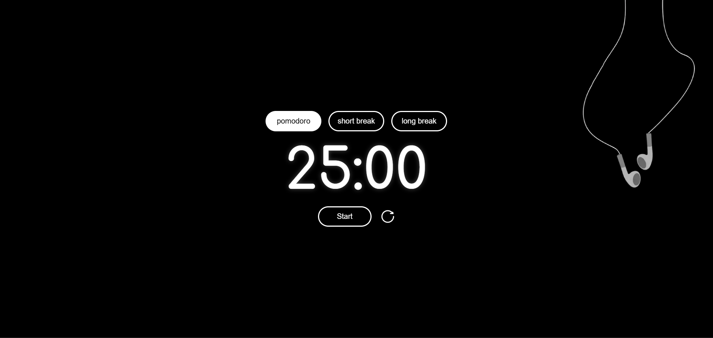

# 🎧 FocusTimer – Minimalist Pomodoro App

**FocusTimer** is a clean, distraction-free Pomodoro timer built with React. It’s designed for mindful productivity with a calm aesthetic, responsive layout, and subtle animations.

 <!-- optional if you add one -->

---

## ✨ Features

- ⏱️ Pomodoro, Short Break, and Long Break modes
- 🎧 Background illustration with floating earphone effect
- 🌀 Animated reset button
- 🔊 Optional sound effect (beep)
- 🎯 Responsive design for desktop, tablet, and mobile
- ⚡ Optimized performance – no 3rd-party cookies

---

## 🚀 Live Demo

[🔗 View the App Here]((https://pomodoro-nu-rosy.vercel.app/))

---

## 📁 Project Structure
src/
├── assets/ # Icons, sounds, background images
├── components/
│ └── Pomodoro/ # Timer.jsx and Background.jsx
├── styles/ # Modular CSS
├── App.jsx
├── index.js


---

## 🛠️ Tech Stack

- ⚛️ React (with Hooks)
- 🎨 CSS3 + Animations
- 📦 Vite / CRA (depending on setup)
- 💡 Lighthouse Score: Accessibility 100, SEO 100, Performance 90+

---

## 📦 Run Locally

```bash
# Install dependencies
npm install

# Run development server
npm start

# Build for production
npm run build

